# Pedro's Bakery
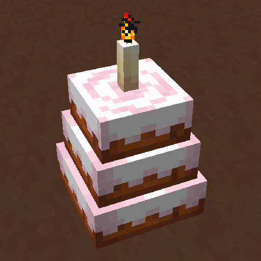

## Baking
To bake a cake or a cupcake, you will first need a beater:

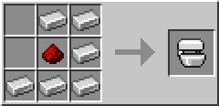

The base of any beater mixture is milk. Let's make the batter first.
For the batter, put the milk and then wheat:

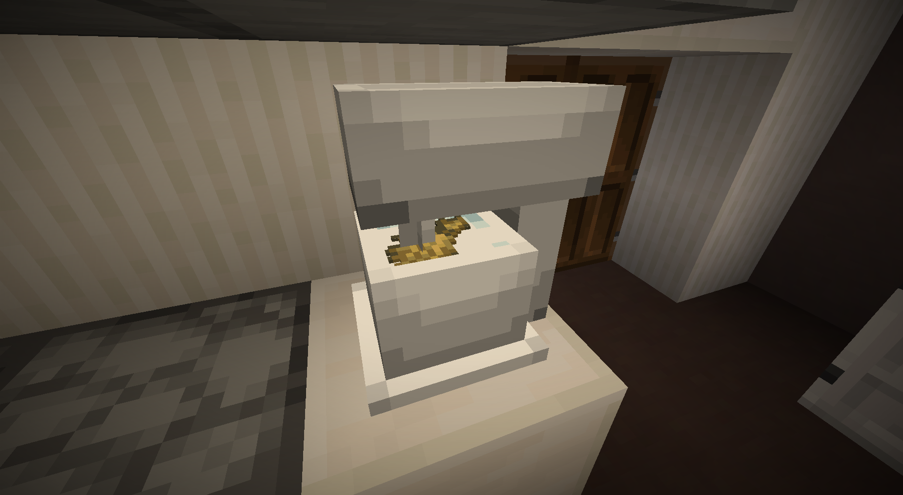

Then power the beater with redstone:

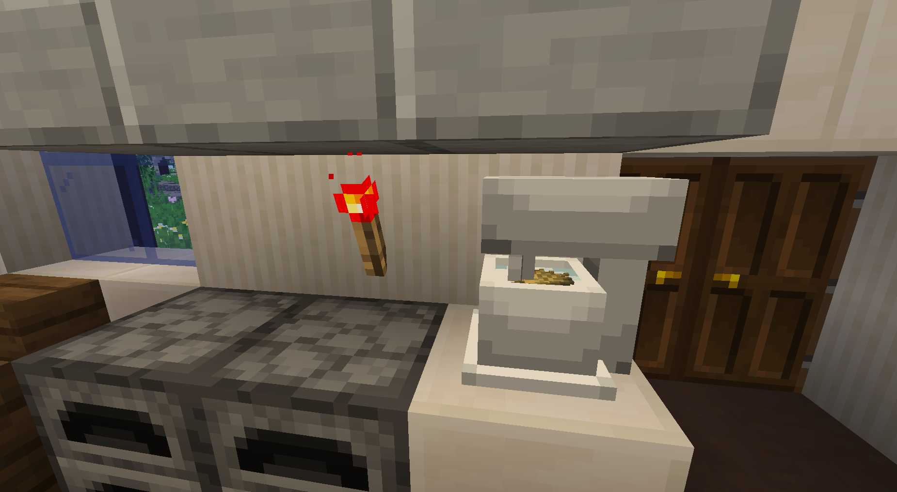

The beater's whisk will start spinning and, after a while, the mixture will turn into batter:

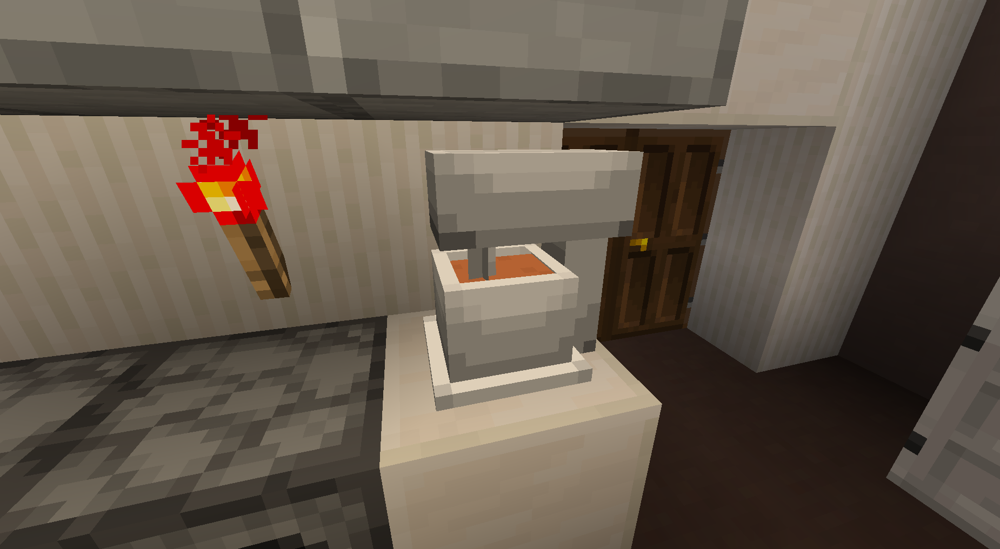

The default batter is vanilla. You can mix certain ingredients (cocoa beans, sweet berries, pumpkin, melon, and bread) to create new batter types. Let's use the vanilla batter for now.

We need a baking tray for the batter:

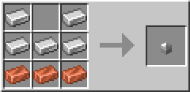

You may notice that the baking tray is too small. Let's expand it to the sides by crafting it with iron on the side:

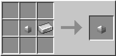

Let's expand it a bit more:

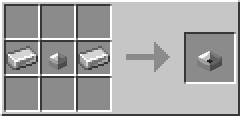

We can now right-click the beater with the baking tray to fill it. Note that it may not be completely filled, so you'll have to make more batter.

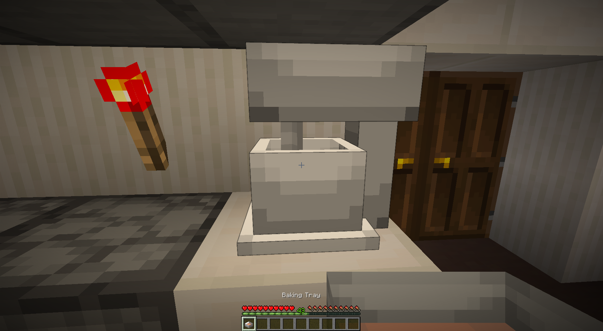

Once you fill the baking tray (completely or otherwise), you can place it on a campfire or magma block to bake the cake:

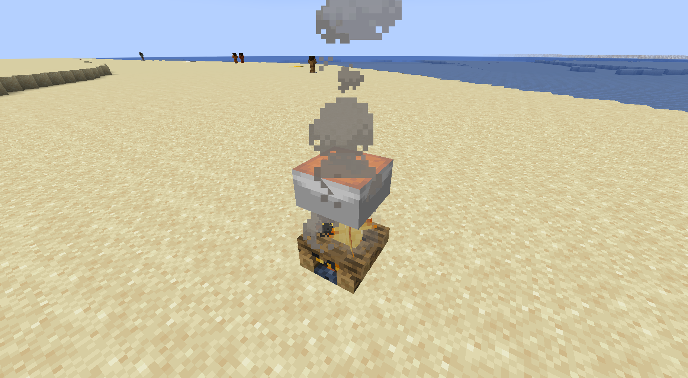

The cake will be perfectly baked once you hear a ding sound.

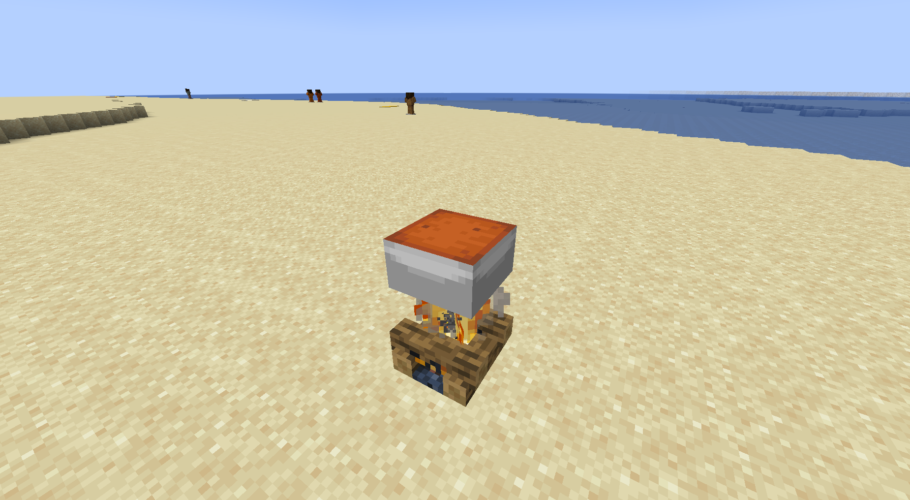

Waiting too long will burn the cake. Burning the cake has no disadvantages other than looking darker.

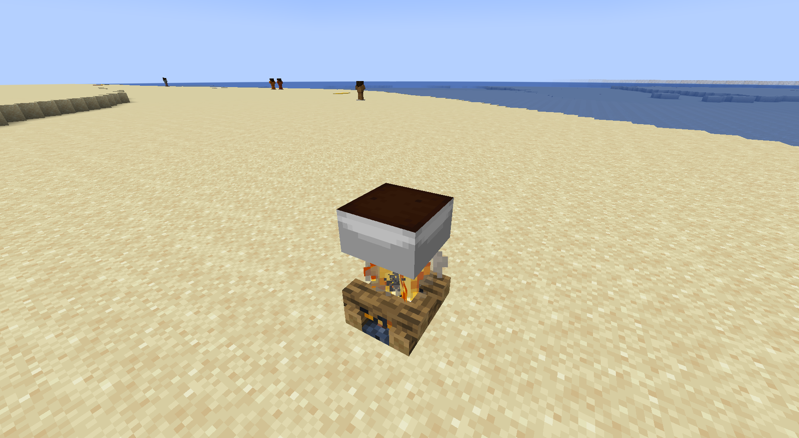

To take the cake off of the tray, simply right-click the tray.

You can also make a coal cake by initially using coal instead of wheat.

### Baking cupcakes
To make cupcakes, do the same with a cupcake tray:

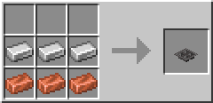

Note that the batter has four holes, meaning four cupcakes.

There is a small difference at the end of the baking process. Instead of right-clicking the tray bare-handed, you need a cupcake liner:

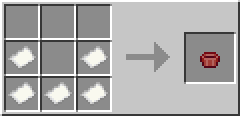

Remember that each tray yields four cupcakes, so you'll need four cupcake liners (or you can eat the cupcake and use the same liner).
Let's see what the cupcake looks like:

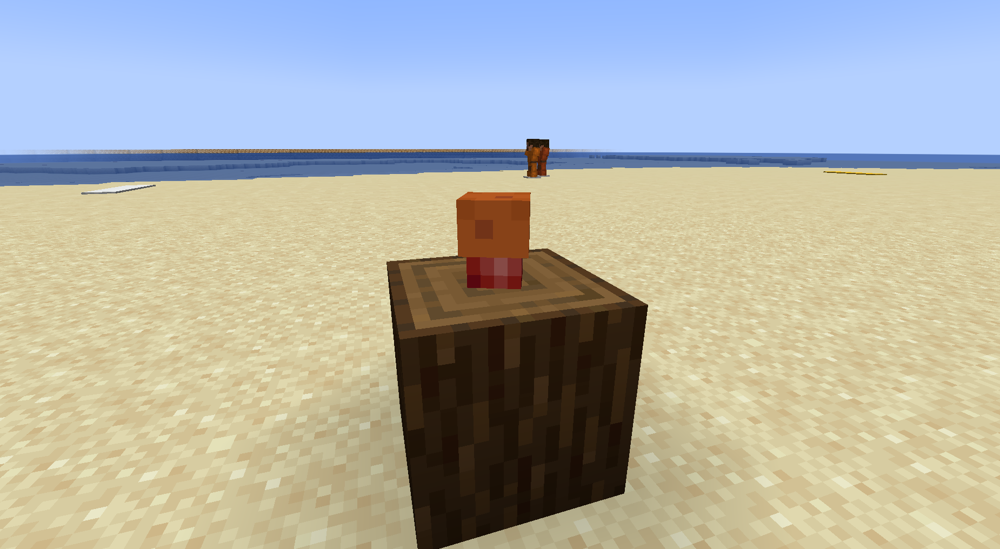

Scrumdiddlyumptious!

## Frosting
You can also create various frostings by first mixing milk with sugar, then with cocoa beans, sculk, chorus fruit, red mushroom, brown mushroom, sweet berries, dirt, or grass.

Let's use the chocolate one: milk + sugar, then sugar top + cocoa beans.

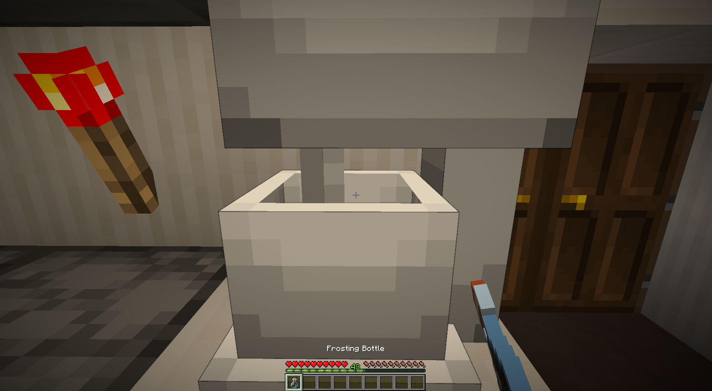

If you pick up the frosting but actually wanted to craft it into further frostings, you can place it back by right-clicking the beater with the bottle.

To use the frosting, simply right-click the cake or cupcake with the bottle:

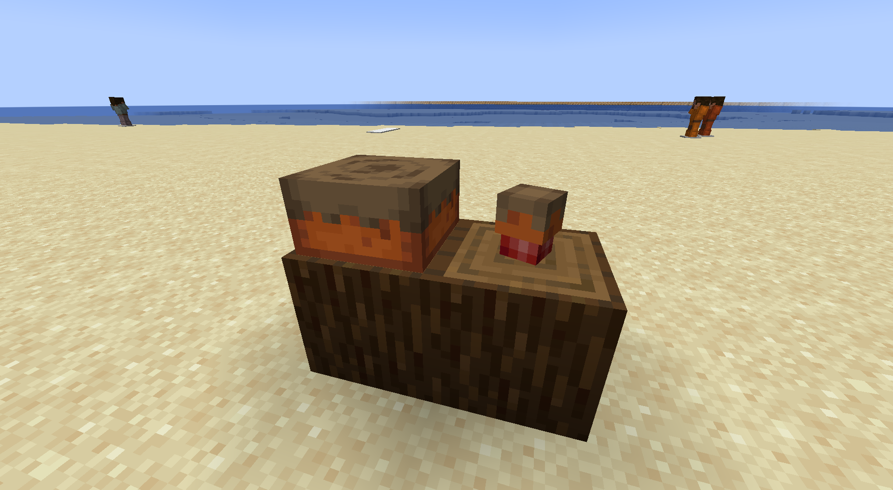

## Features
Cakes (not cupcakes) can have extra features, like berries on top or an enchantment glint. Those are applied by right-clicking the cake. Try them out:

| Item                   | Feature                   |
|------------------------|---------------------------|
| Enchanted Golden Apple | Glint                     |
| Nether Star            | Glint                     |
| Soul Soil              | Souls                     |
| Soul Sand              | Souls                     |
| Sweet Berries          | Sweet Berries             |
| Red Mushroom           | Red Mushroom              |
| Brown Mushroom         | Brown Mushroom            |
| Glow Berries           | Glow Berries              |
| Eye of Ender           | End Dust                  |
| Honey Bottle           | Honey                     |
| Painting               | Painting[1]    |
| Dandelion              | Dandelion                 |
| Torchflower            | Torchflower               |
| Poppy                  | Poppy                     |
| Blue Orchid            | Blue Orchid               |
| Allium                 | Allium                    |
| Azure Bluet            | Azure Bluet               |
| Red Tulip              | Red Tulip                 |
| Orange Tulip           | Orange Tulip              |
| White Tulip            | White Tulip               |
| Pink Tulip             | Pink Tulip                |
| Oxeye Daisy            | Oxeye Daisy               |
| Cornflower             | Cornflower                |
| Wither Rose            | Wither Rose               |
| Lily of the Valley     | Lily of the Valley        |
| Glass                  | Glass                     |
| Player Head            | Player Head[2] |
| Short Grass            | Short Grass               |
| White Sprinkles        | White Sprinkles           |
| Orange Sprinkles       | Orange Sprinkles          |
| Magenta Sprinkles      | Magenta Sprinkles         |
| Light Blue Sprinkles   | Light Blue Sprinkles      |
| Yellow Sprinkles       | Yellow Sprinkles          |
| Lime Sprinkles         | Lime Sprinkles            |
| Pink Sprinkles         | Pink Sprinkles            |
| Gray Sprinkles         | Gray Sprinkles            |
| Light Gray Sprinkles   | Light Gray Sprinkles      |
| Cyan Sprinkles         | Cyan Sprinkles            |
| Purple Sprinkles       | Purple Sprinkles          |
| Blue Sprinkles         | Blue Sprinkles            |
| Brown Sprinkles        | Brown Sprinkles           |
| Green Sprinkles        | Green Sprinkles           |
| Red Sprinkles          | Red Sprinkles             |
| Black Sprinkles        | Black Sprinkles           |

[1] Depends on the painting item, with a random painting being chosen for the random painting item. The specific painting is saved when the world closes. 
[2] The specific player head is saved when the world closes.

## Sprinkles
Sprinkles are simply crafted by combining cocoa beans with a dye.